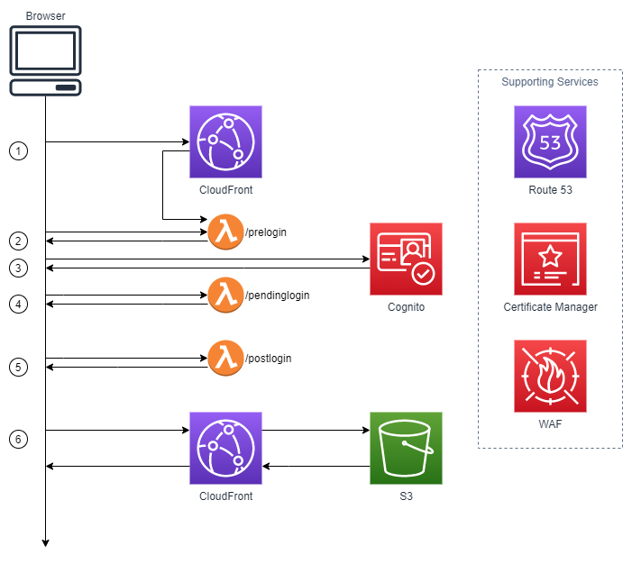

# Private (Cloud) Fronts

## What is this

**Private (Cloud) Fronts** demonstrates a method for restricting access to CloudFront distributions by requiring visitors to first authenticate against AWS Cognito. This repository contains the source code for the accompanying blog posts (which cover this topic in more detail):



## Predeployment steps

1. Clone this repository
2. In your IDE of choice, perform a global search-and-replace on the following:

  | Key                 | Example              | Description                                                                                             |
  | ------------------- | -------------------- | ------------------------------------------------------------------------------------------------------- |
  | @@AWS_PROFILE@@     | default              | AWS CLI profile to use to deploy the Lambda functions                                                   |
  | @@AWS_ACCOUNT_ID@@  | 1111222233333        | AWS Account ID, used below to upload the private key to Secrets Manager                                 |
  | @@AWS_REGION@@      | ap-southeast-2       | AWS CLI region to deploy the Lambda functions into                                                      |
  | @@NAME_CAMEL_CASE@@ | PrivateCloudFronts   | Used to name things where the name can be mixed-case.                                                   |
  | @@NAME_KEBAB_CASE@@ | private-cloud-fronts | Used in naming resources like Parameter Store keys, S3 buckets, etc where the name has to be lower case |

## Deployment steps

High level steps to follow are:

1. Generate a public and private key for CloudFront
2. Deploy Lambda functions
3. Deploy CloudFormation stack
4. Upload the private key to [AWS Secrets Manager](https://aws.amazon.com/secrets-manager/)
5. Copy website files to S3
6. Launch the website in your browser

```bash
# Generate a public and private key for CloudFront
openssl genrsa -out private_key.pem 2048
openssl rsa -pubout -in private_key.pem -out public_key.pem

# Lambda Functions
cd lambdas
npm i
sls deploy

# Deploy CloudFormation stack
cd ..
PUBLIC_KEY=$(<public_key.pem)
aws --profile @@AWS_PROFILE@@ --region @@AWS_REGION@@ cloudformation deploy \
  --template-file infrastructure/infrastructure.yml \
  --stack-name "@@NAME_CAMEL_CASE@@" \
  --no-fail-on-empty-changeset \
  --parameter-overrides \
    "ParamBucketName=@@NAME_KEBAB_CASE@@" \
    "ParamCognitoDomainName=@@NAME_KEBAB_CASE@@" \
    "ParamCognitoUserPoolName=@@NAME_CAMEL_CASE@@" \
    "ParamEncodedPublicKey=${PUBLIC_KEY}"

# Upload the private key to AWS Security Manager
PRIVATE_KEY=$(<private_key.pem)
aws --profile @@AWS_PROFILE@@ --region @@AWS_REGION@@ secretsmanager put-secret-value \
  --secret-id "arn:aws:secretsmanager:@@AWS_REGION@@:@@AWS_ACCOUNT_ID@@:secret:/@@NAME_KEBAB_CASE@@/cloudfront/private-key" \
  --secret-string "${PRIVATE_KEY}"

# Copy website files to S3
aws --profile @@AWS_PROFILE@@ --region @@AWS_REGION@@ s3 cp website/ s3://@@NAME_KEBAB_CASE@@-website --recursive

# Launch the website
DISTRIBUTION_URL=$(aws --profile @@AWS_PROFILE@@ --region @@AWS_REGION@@ cloudformation describe-stacks --stack-name "@@NAME_CAMEL_CASE@@" --output text --query "Stacks[0].Outputs[?OutputKey=='DistributionUrl'].OutputValue")

# Linux
#xdg-open $DISTRIBUTION_URL

# OSX
#open $DISTRIBUTION_URL

# Windows
#start $DISTRIBUTION_URL
```

## Undeployment steps

1. Remove the S3 buckets:

    ```bash
    aws --profile @@AWS_PROFILE@@ --region @@AWS_REGION@@ s3 rb s3://@@NAME_KEBAB_CASE@@-website --force
    aws --profile @@AWS_PROFILE@@ --region @@AWS_REGION@@ s3 rb s3://@@NAME_KEBAB_CASE@@-logs --force  
    ```

2. Remove the CloudFormation stacks

   ```bash
   aws --profile @@AWS_PROFILE@@ --region @@AWS_REGION@@ cloudformation delete-stack --stack-name "@@NAME_CAMEL_CASE@@"
   aws --profile @@AWS_PROFILE@@ --region @@AWS_REGION@@ cloudformation wait stack-delete-complete --stack-name "@@NAME_CAMEL_CASE@@"
   ```

3. Remove the Lambda functions

   ```bash
   cd lambdas
   sls remove
   ```
